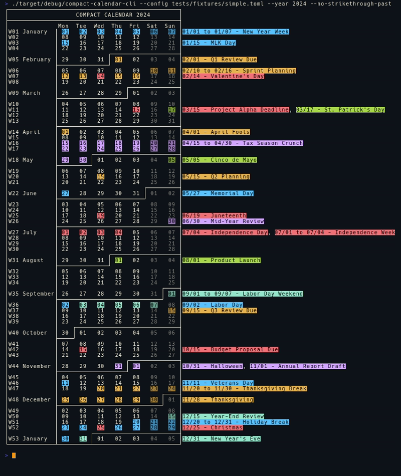

compact-calendar-cli
===============================

[](https://github.com/wcampbell0x2a/compact-calendar-cli)
[](https://crates.io/crates/compact-calendar-cli)
[](https://docs.rs/compact-calendar-cli)
[](https://github.com/wcampbell0x2a/compact-calendar-cli/actions?query=branch%3Amaster)

A compact year-at-a-glance calendar CLI with TOML-based event highlighting.

Inspired by [David Seah's Compact Calendar](https://davidseah.com/node/compact-calendar/).

- **Compact Display** — Display an entire year in a space-efficient format with week numbers.
- **TOML Configuration** — Define events, date ranges, and colors via simple TOML configuration.
- **Smart Formatting** — Automatic weekend dimming, strikethrough for past dates, and customizable color-coding.
- **Work Mode** — Exclude weekends from color highlighting for work-focused calendars.



## Binary
Either build from published source in crates.io.
*Compiler support: requires rustc 1.82.0+*
```
$ cargo install compact-calendar-cli --locked
```

Or download from [github releases](https://github.com/wcampbell0x2a/compact-calendar-cli/releases).

### Usage
```no_test
A compact calendar CLI with TOML-based date details

Usage: compact-calendar-cli [OPTIONS]

Options:
  -y, --year <YEAR>              Year to display (defaults to current year)
  -c, --config <CONFIG>          Path to TOML configuration file with date details [default: calendar.toml]
  -s, --sunday                   Week starts on Sunday (default is Monday)
      --no-dim-weekends          Don't dim weekend dates (by default weekends are dimmed)
  -w, --work                     Work mode: never apply colors to Saturday/Sunday
      --no-strikethrough-past    Don't strikethrough past dates (by default past dates are crossed out)
  -h, --help                     Print help
  -V, --version                  Print version
```

## Configuration

Create a `calendar.toml` file to define your events and date ranges:

```toml
# Date ranges with colors
[[ranges]]
start = "2025-01-01"
end = "2025-01-15"
color = "blue"
description = "New Year Sprint"

# Yearly recurring ranges (format: MM-DD)
[[ranges]]
start = "12-25"
end = "12-31"
color = "cyan"
description = "Holiday Break"

# Individual dates
[dates."2025-04-01"]
description = "Project Deadline"
color = "red"

# Yearly recurring events (format: MM-DD)
[dates."01-01"]
description = "New Year's Day"
color = "yellow"
```

### Available Colors

`orange`, `yellow`, `green`, `blue`, `purple`, `red`, `cyan`, `gray`, `light_orange`, `light_yellow`, `light_green`, `light_blue`, `light_purple`, `light_red`, `light_cyan`
